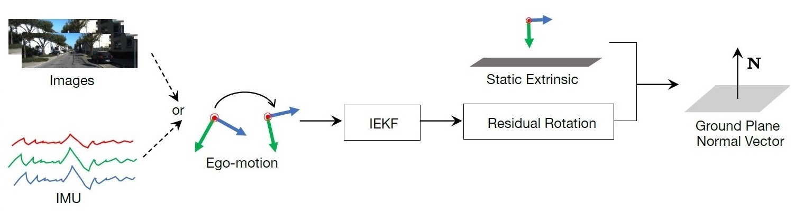

# ground_normal_filter
Official implementation of: Towards Accurate Ground Plane Normal Estimation from Ego-Motion  
[Paper](https://www.mdpi.com/1424-8220/22/23/9375) | [Arxiv](https://arxiv.org/abs/2212.04224)
| [Youtube]() | [Bilibili](https://www.bilibili.com/video/BV1sW4y1M79W/)

<p align="left">
  
</p>

## TL;DR
Estimate ground plane normal vector from **ONLY** odometry information
<p align="left">
  
</p>

## Quick Start
### 📦 Prepare data
* Download the [KITTI Odometry dataset](http://www.cvlibs.net/datasets/kitti/eval_odometry.php).
* Prepare odometry results
  * One example has already been provided in `odometry/orbslam2/00.txt`.
  * You can download full results from [here](https://github.com/Huangying-Zhan/DF-VO#part-4-result-evaluation)

### 🏗️️ Setup
```bash
python3 -m pip install -r requirements.txt  
sudo apt install ffmpeg  # for video visualization
```

### 🏃 Run the example
```bash
python3 src/run_kitti.py \
    --sequence 00 \
    --kitti_root /path/to/kitti/odometry/sequences \
    --pose_root odometry/orbslam2 \
    --output_root results
ffmpeg -y -framerate 10 -pattern_type glob -i 'results/vis/*.jpg' results/video.mp4
```


## Citation
If you find our work useful, please consider citing our paper:
```
@article{zhang2022towards,
  title={Towards Accurate Ground Plane Normal Estimation from Ego-Motion},
  author={Zhang, Jiaxin and Sui, Wei and Zhang, Qian and Chen, Tao and Yang, Cong},
  journal={Sensors},
  volume={22},
  number={23},
  pages={9375},
  year={2022},
  publisher={Multidisciplinary Digital Publishing Institute}
}
```